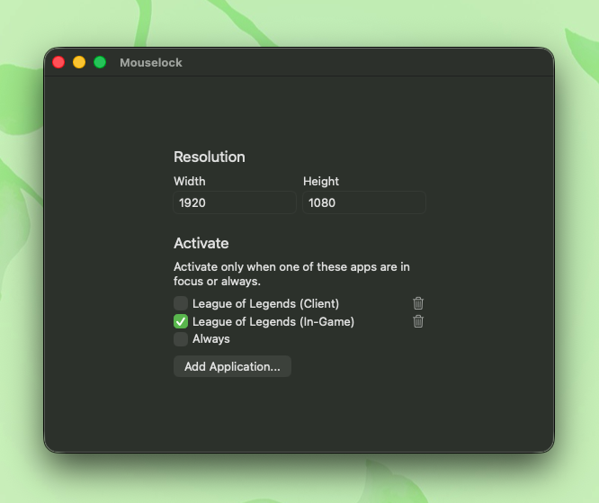

<h1 align="center">
  
   
  Mouselock
</h1>

  
   
  Lock mouse cursor to a centered area of the screen for MacOS.
   
  

## Why?

In League of Legends (and other games), the cursor is not locked properly in borderless mode, nor in fullscreen with a second display. This app aims to fix that.

## Features

- Lock the cursor to a centered, configurable resolution area
- Choose which apps trigger the lock — add any app from a picker, or activate always

## Requirements

Requires MacOS 11.0 or later.

## Usage

- Set your desired locked resolution under **Resolution**.
- Under **Activate**, click **Add Application...** to pick any app from a file browser — Mouselock will lock the cursor whenever that app is focused. Click the trash icon next to an entry to remove it.
- Toggle **Always** to lock the cursor regardless of which app is focused.

## Tips
- Steam games generally aren't in `/Applications` — they're usually under `~/Library/Application Support/Steam/steamapps/common/<game>/`. Use the file picker's path shortcut (`⌘⇧G`) to jump straight there when adding a Steam app.

- League of Legends runs as two separate processes — the client (champ select, lobby, etc.) and the actual game. If you want the lock active through both, enable both from the picker rather than just **In-Game**. If you need to re-add either League app, both `.app` files are inside the package contents of `/Applications/League of Legends.app`. The app selector doesn't let you view package contents, so use the `⌘⇧G` shortcut and enter:
  - **League Client:** `/Applications/League of Legends.app/Contents/LoL/League of Legends.app`
  - **Game Client:** `/Applications/League of Legends.app/Contents/LoL/Game/LeagueofLegends.app`

- If you only want the lock active while actually in a game, enable only **In-Game**.

- Get [LinearMouse](https://linearmouse.org) to remove mouse acceleration.
- Enable [MetalBetaTest](https://www.reddit.com/r/LeaguePBE/comments/jgzjg1/mac_on_metal_beta_testing) for League of Legends to get better performance.